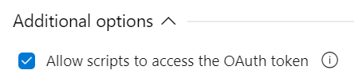
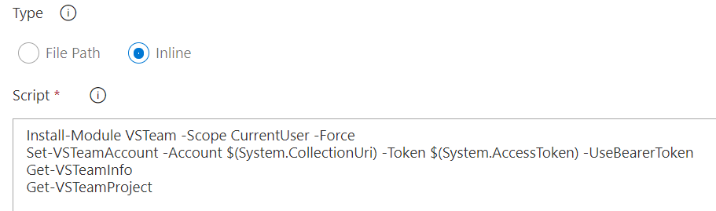

# Using BearerToken Authentication

When using [Azure DevOps](https://docs.microsoft.com/azure/devops/?view=azure-devops&WT.mc_id=repo-github-dbrown) you can use the BearerToken form of authentication with VSTeam.

## YAML Build

For YAML builds the PowerShell task will work without having to enable OAuth token access.

```yml
- task: PowerShell@2
  inputs:
    targetType: 'inline'
    script: |
      Install-Module VSTeam -Scope CurrentUser -Force
      Set-VSTeamAccount -Account $(System.CollectionUri) -Token $(System.AccessToken) -UseBearerToken
      Get-VSTeamInfo
      Get-VSTeamProject
```

## Classic Editor

You first must enable access to the OAuth token on the Agent Job.



Then you can add a PowerShell task to your build.


Now simply copy and paste the code into the task using the **Inline** option.



## Notes

The BearerToken is scoped to the project executing the script. To access other instances you must use a [Personal Access Token](https://docs.microsoft.com/azure/devops/organizations/accounts/use-personal-access-tokens-to-authenticate?view=azure-devops&tabs=preview-page&WT.mc_id=repo-github-dbrown).

Tags: `AzureDevOps, BearerToken, AzurePipelines`
